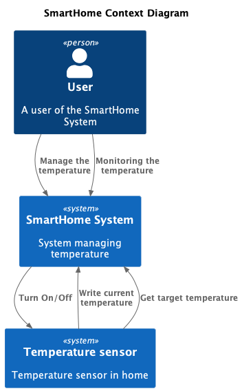
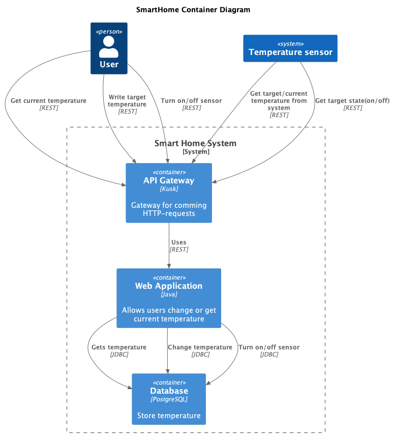
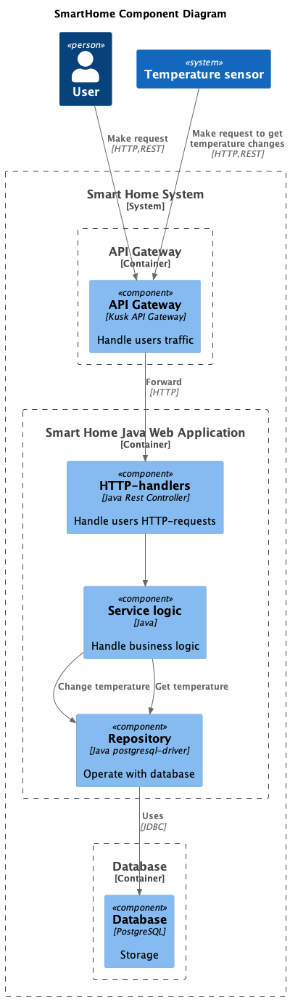
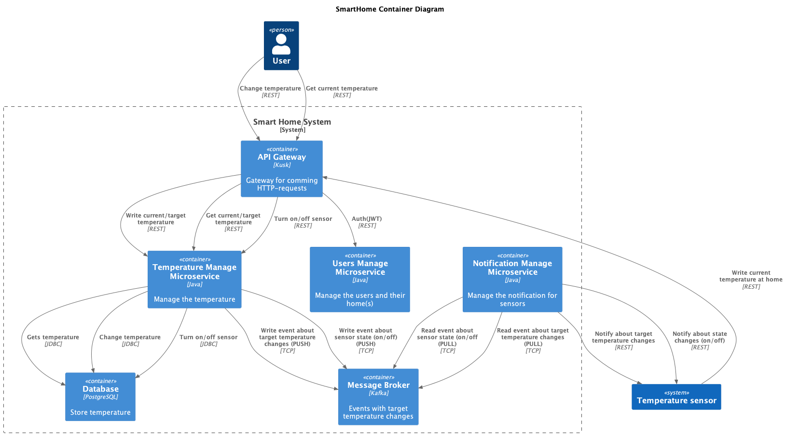
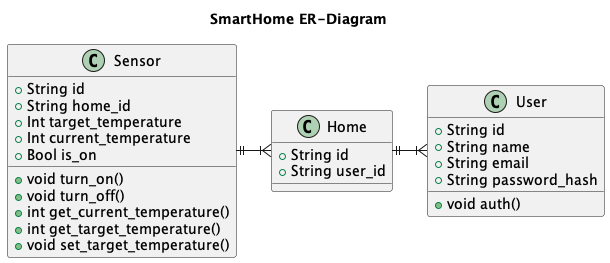

# Документация

## Smart-Home

Система управления умным домом.

### AsIs

[Все диаграммы](docs/as-is-diagrams/)

#### Context



#### Container



#### Component



#### Проблема

Синхронное взаимодействие с датчиками приводит к излишней нагрузке системы. Так как датчику необходимо совершать периодические запросы к системе для отслеживания изменений своего состояния.​​​​​​​

### ToBe

[Все диаграммы](docs/to-be-diagrams/)

#### Container



##### Users Manage Microservice

Микросервис управления пользовательскими данными и аутентификацией.

[OpenAPI Specification](docs/to-be-diagrams/openapi-users.json)

##### Temperature Manage Microservice

Микросервис для операций по изменению состояний устройств. А также позволяет понять актуальную температуру.

[OpenAPI Specification](docs/to-be-diagrams/openapi-temperature.json)

##### Notification Manage Microservice

Микросервис для отправки уведомлений о событиях. Отправляет уведомления устройствам в умных домах об изменении их состояния.

#### ER-Diagram



# Базовая настройка

## Запуск minikube

[Инструкция по установке](https://minikube.sigs.k8s.io/docs/start/)

```bash
minikube start
```


## Добавление токена авторизации GitHub

[Получение токена](https://github.com/settings/tokens/new)

```bash
kubectl create secret docker-registry ghcr --docker-server=https://ghcr.io --docker-username=<github_username> --docker-password=<github_token> -n default
```


## Установка API GW kusk

[Install Kusk CLI](https://docs.kusk.io/getting-started/install-kusk-cli)

```bash
kusk cluster install
```


## Настройка terraform

[Установите Terraform](https://yandex.cloud/ru/docs/tutorials/infrastructure-management/terraform-quickstart#install-terraform)


Создайте файл ~/.terraformrc

```hcl
provider_installation {
  network_mirror {
    url = "https://terraform-mirror.yandexcloud.net/"
    include = ["registry.terraform.io/*/*"]
  }
  direct {
    exclude = ["registry.terraform.io/*/*"]
  }
}
```

## Применяем terraform конфигурацию 

```bash
cd terraform
terraform apply
```

## Настройка API GW

```bash
kusk deploy -i api.yaml
```

## Проверяем работоспособность

```bash
kubectl port-forward svc/kusk-gateway-envoy-fleet -n kusk-system 8080:80
curl localhost:8080/hello
```


## Delete minikube

```bash
minikube delete
```
